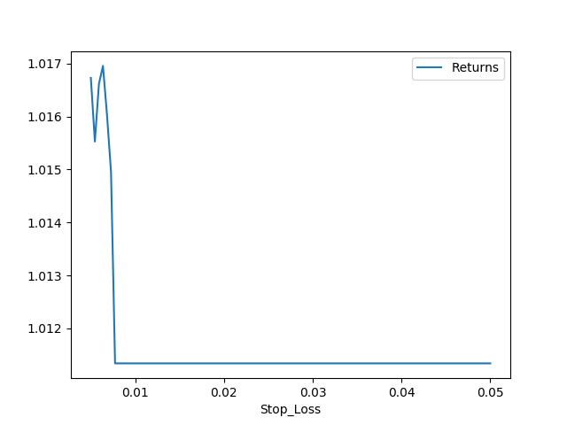
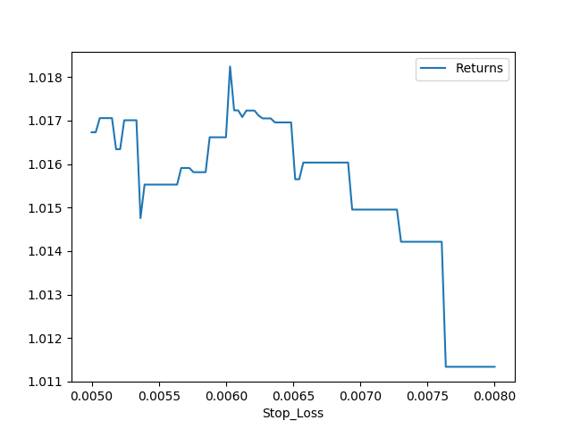
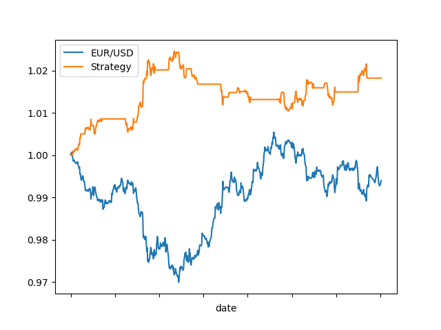

# Bank Open Trade

Written by Ian Shaw. 

Credit to Ryan (ryan@thestreets.co) for outlining this concept to me in his excellent introductory course to FOREX trading.

## Strategy Outline

1. Place buy stop and sell stop (resting volatility box) at the high and low (respectively) of the two hours prior to the bank open of London or Japan. Stop loss on opposite ends of the box.
2. Make trailing stop.

The intution of this is quite important. Opening of major bank sessions welcomes a flood of volume in currency movement, whose suddeness could create a quick price shift in either direction.

## Creating the Signal

1. Break up the time series into windows, so only ever dealing with a specific window (Bank open to 2 hours before next open session)

2. Set indicator on series to see if breaks above or below the set stop orders

3. Take the first break through (bank open trade only cares about the first spike in volatility)

4. Take the cumulative maximum (or minimum) to that point

5. Take the difference between that cumulative metric and the current price

6. If  the drawdown is ever greater than 5 bips, that is where the trade would end.

## Data

For this investigation, we used a hourly time series of the EUR/USD currency pair traded from July 31, 2018 to September 11, 2018. 

## Hyperparameter Tuning

For our initial efforts, we did a superficial tunign of the stop loss parameter. We found that a stop loss of 6.03 bips created a higher return than the prescribed 5 bips. Keep in mind this tuning was done without any cross validation and over a small sample set. 

## Backtest Results

Below you can see that the strategy out performs the currency's own movements.

The quick (non-annualized) metrics are

| Metric       | Score  |
| ------------ | ------ |
| Max Drawdown | -1.38% |
| Sharpe Ratio | 14.11  |
| Return       | 1.82%  |

## Conclusion

This initial exploration into the Bank open trade shows that it may have viability as a consistent play, but much more rigorous investigation is advised before investment.

## Future Work

This report was intended to serve as a first volley towards backtesting efforts. The trade should be further explored on different timelines, with careful observation of transaction costs, the possibility of leveage, and other currency pairs. That investigation would also explore other hyperparameter turning of the volatility window for setting the orders.
